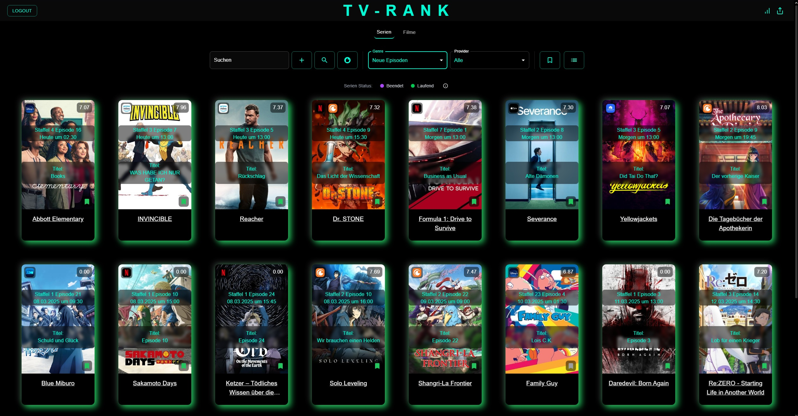

# TV-RANK

TV-RANK ist eine umfassende Serienverwaltungs-App, die es Benutzern ermöglicht, ihre Lieblingsserien und -filme zu entdecken, zu bewerten und zu verwalten. Die App bietet eine Vielzahl von Funktionen, darunter die Möglichkeit, Serien nach Genre und Anbieter zu filtern, Bewertungen anzuzeigen und zu bearbeiten sowie detaillierte Statistiken zu den angesehenen Serien und Filmen zu erhalten.

## Funktionen

- **Serien und Filme anzeigen und durchsuchen**: Durchsuchen Sie eine umfangreiche Datenbank von Serien und Filmen.
  
  
- **Filteroptionen**: Filtern Sie Serien und Filme nach Genre und Anbieter.
- **Bewertungen anzeigen und bearbeiten**: Sehen Sie sich Bewertungen an und passen Sie diese nach Ihren Vorlieben an.
  
- **Watchlist verwalten**: Fügen Sie Serien und Filme zu Ihrer Watchlist hinzu und behalten Sie den Überblick über Ihre Favoriten.
  
- **Keine Episode mehr verpassen**: Sie sehen immer wann die nächste Episode Ihrer Lieblingsserien erscheint.
  
- **Nie vergessen wo Sie stehen**: Sie Wissen immer genau wo sie eine Serie Pausiert haben.
  
- **Statistiken anzeigen**: Erhalten Sie detaillierte Statistiken über Ihre angesehenen Serien und Filme.
  
- **Empfehlungen anzeigen**: Erhalten Sie Empfehlungen für neue Serien und Filme anhand Ihrer Liste.
  
- **Unveröffentlichte Serien und Filme finden**: Entdecken sie unveröffentlichte Serien und Filme und sehen Sie, wann diese erscheinen.
  

## Technologien

- **React**: Für die Benutzeroberfläche.
- **TypeScript**: Für die Typensicherheit und bessere Wartbarkeit des Codes.
- **Firebase**: Für Authentifizierung und Datenbank.
- **Material-UI**: Für die Gestaltung der Benutzeroberfläche.
- **Framer Motion**: Für Animationen.
- **Vite**: Als Build-Tool.

## Live-Demo

Die Anwendung ist live unter [tv-rank.de](https://tv-rank.de) verfügbar.

## Installation

1. Repository klonen:

   ```bash
   git clone <repository-url>
   cd <repository-verzeichnis>
   ```

2. Abhängigkeiten installieren:

   ```bash
   npm install
   ```

3. Firebase-Konfiguration einrichten:
   Erstellen Sie eine `.env`-Datei im Stammverzeichnis und fügen Sie Ihre Firebase-Konfigurationsvariablen hinzu:
   ```env
   VITE_APIKEY=<Ihre-API-KEY>
   VITE_AUTHDOMAIN=<Ihre-AUTH-DOMAIN>
   VITE_DATABASEURL=<Ihre-DATABASE-URL>
   VITE_PROJECTID=<Ihre-PROJECT-ID>
   VITE_STORAGEBUCKET=<Ihre-STORAGE-BUCKET>
   VITE_MESSAGINGSENDERID=<Ihre-MESSAGING-SENDER-ID>
   VITE_APPID=<Ihre-APP-ID>
   VITE_MEASUREMENTID=<Ihre-MEASUREMENT-ID>
   VITE_API_TMDB=<Ihre-TMDB-API-KEY>
   VITE_USER=<Ihr-Benutzername>
   ```

## Entwicklung

1. Entwicklungsserver starten:

   ```bash
   npm run dev
   ```

2. Anwendung im Browser öffnen:
   ```bash
   http://localhost:5173
   ```

## Build und Deployment

1. Anwendung bauen:

   ```bash
   npm run build
   ```

2. Anwendung auf Firebase deployen:
   ```bash
   firebase deploy
   ```

## Linting

1. Code linten:
   ```bash
   npm run lint
   ```

## Vorschau

1. Produktions-Build-Vorschau:
   ```bash
   npm run preview
   ```

## Lizenz

Dieses Projekt ist unter der MIT-Lizenz lizenziert.

## Hinweise

- Dies ist nur das Frontend der Anwendung. Das Backend zum Hinzufügen der Serien und Filme muss separat erstellt werden.
- Die Anwendung verwendet Firebase Authentication und Firebase Realtime Database.
